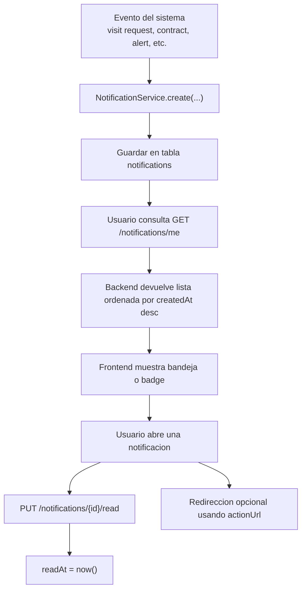
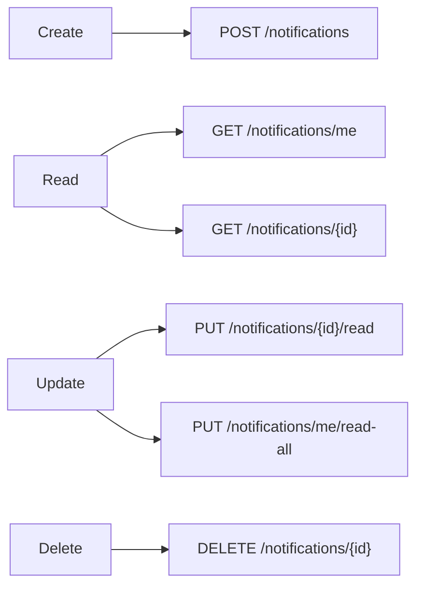
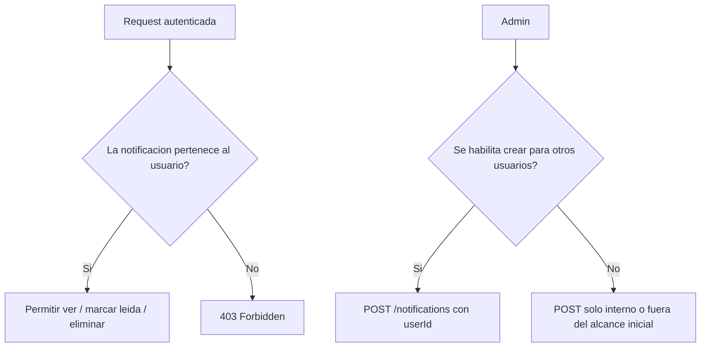
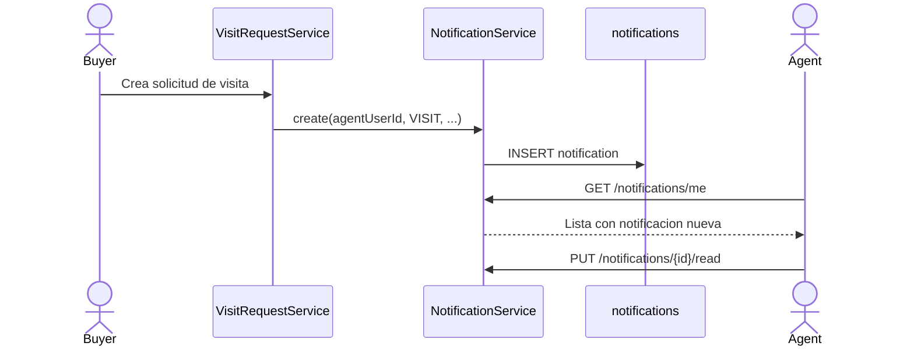
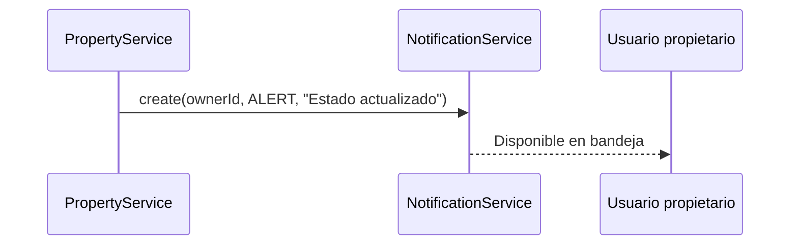
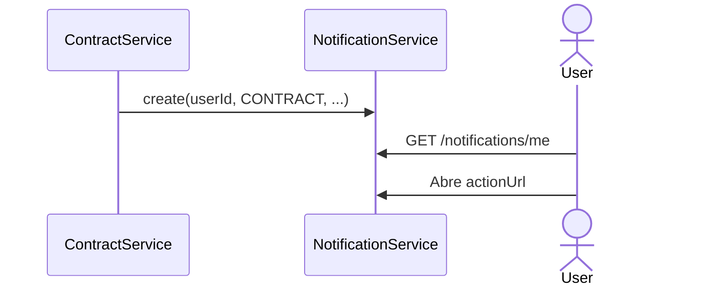
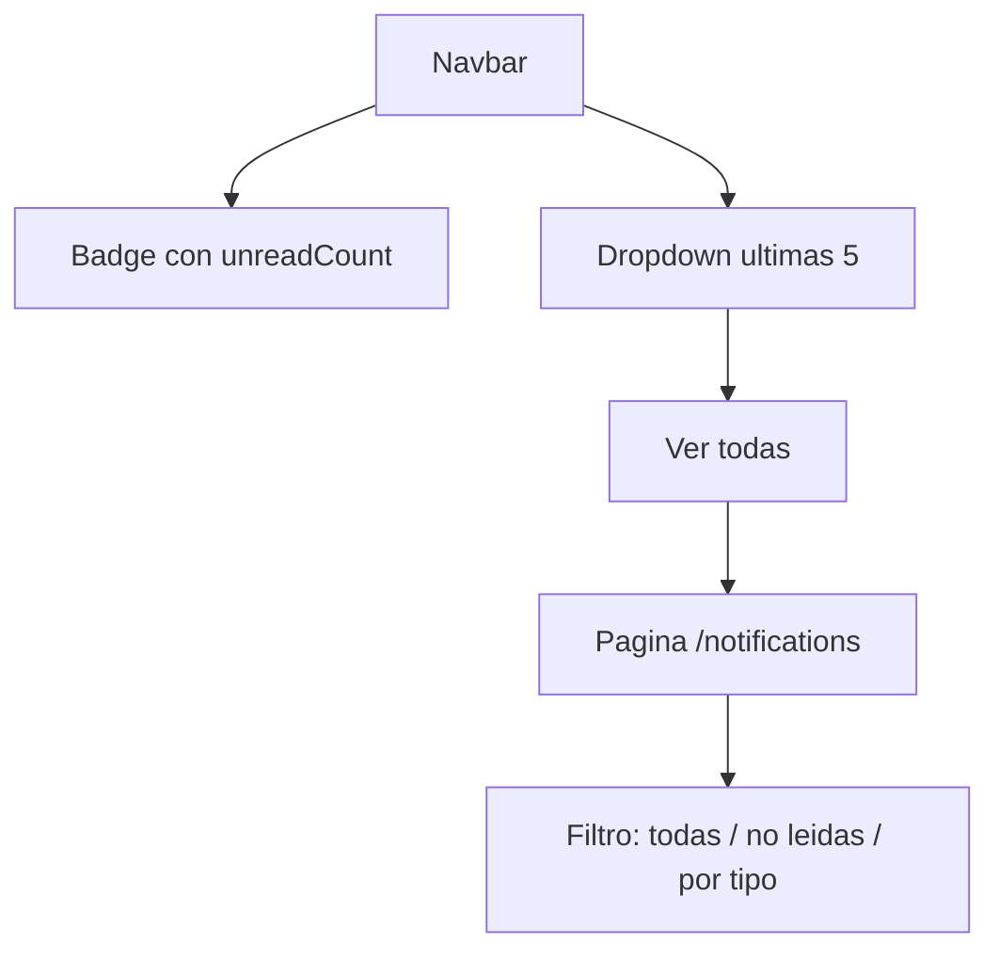

# Notifications CRUD - Flujo y alcance sugerido

Documentacion de referencia para la tarea `[Backend] CRUD de Notifications` en OpenRoof.

## 1. Objetivo del modulo

El modulo de notificaciones sirve para registrar eventos importantes del sistema y mostrarselos al usuario autenticado para que luego pueda:

- ver sus notificaciones
- marcar una notificacion como leida
- marcar todas como leidas
- eliminar una notificacion de su bandeja

En este proyecto, la entidad base ya existe en [`Notification.java`](../src/main/java/com/openroof/openroof/model/notification/Notification.java) y soporta:

- `user`
- `type`
- `title`
- `message`
- `data` (JSONB)
- `actionUrl`
- `readAt`

## 2. Flujo general

## 3. Flujo CRUD

## 4. Flujo de permisos

## 5. Tipos de notificaciones sugeridos

El enum actual ya tiene estos tipos:

- `SYSTEM`
- `ALERT`
- `MESSAGE`
- `CONTRACT`
- `VISIT`
- `OFFER`
- `REVIEW`

### Como usarlos en OpenRoof

| Tipo | Cuando se dispara | Ejemplo de titulo | `data` sugerido | `actionUrl` sugerido |
|------|--------------------|-------------------|-----------------|----------------------|
| `SYSTEM` | Eventos generales del sistema | Perfil actualizado | `userId` | `/profile` |
| `ALERT` | Recordatorios o advertencias | Tienes una propiedad pendiente | `propertyId` | `/properties/me` |
| `MESSAGE` | Mensajeria futura | Nuevo mensaje del agente | `conversationId` | `/messages` |
| `CONTRACT` | Contratos o firmas | Contrato listo para revisar | `contractId` | `/contracts/12` |
| `VISIT` | Solicitudes o cambios de visita | Nueva solicitud de visita | `visitRequestId`, `propertyId` | `/visit-requests` |
| `OFFER` | Ofertas economicas | Recibiste una oferta | `offerId`, `propertyId` | `/offers/3` |
| `REVIEW` | Revisiones, feedback o moderacion | Tu propiedad fue revisada | `reviewId`, `propertyId` | `/properties/45` |

## 6. Flujo recomendado por caso de uso

### A. Solicitud de visita

### B. Cambio de estado de propiedad

### C. Contrato disponible

## 7. Endpoints recomendados

| Metodo | Endpoint | Uso |
|--------|----------|-----|
| `POST` | `/notifications` | Crear notificacion |
| `GET` | `/notifications/me` | Listar mis notificaciones |
| `GET` | `/notifications/{id}` | Ver una notificacion propia |
| `PUT` | `/notifications/{id}/read` | Marcar una como leida |
| `PUT` | `/notifications/me/read-all` | Marcar todas como leidas |
| `DELETE` | `/notifications/{id}` | Eliminar una notificacion |
| `GET` | `/notifications/me/unread-count` | Contar no leidas |

## 8. Modelo mental del frontend futuro

Hoy el frontend no tiene aun un modulo visible de notificaciones, pero este backend ya puede dejar listo el contrato para:

- un badge en navbar
- un dropdown de notificaciones
- una pagina tipo inbox

## 9. Alcance recomendado para la tarea actual

Si la tarea dice solo backend, el MVP mas razonable seria:

1. CRUD basico con seguridad por usuario
2. `mark as read`
3. `mark all as read`
4. `unread count`
5. tests de servicio y controller

No parece necesario en esta primera entrega:

- websocket o notificaciones en tiempo real
- preferencias avanzadas
- edicion libre del contenido de una notificacion desde frontend

## 10. Donde ver este flujo visualmente

Opciones simples:

- Abrir este archivo en VS Code o Cursor con Markdown Preview
- Subirlo a GitHub para que renderice los diagramas Mermaid
- Copiar el bloque Mermaid a [Mermaid Live Editor](https://mermaid.live/)

Si queres una presentacion mas "tipo web interna", este mismo documento puede convertirse despues en:

- una pagina en `backend/docs`
- una wiki de GitHub
- una pagina de documentacion en Swagger complementada con ejemplos
