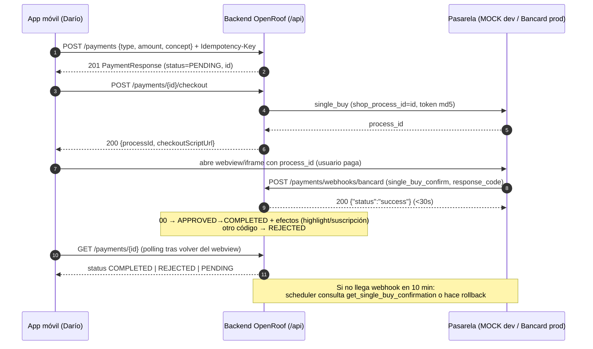

# OpenRoof — API de Pagos · Guía para la app móvil

> **Audiencia:** Darío (desarrollo móvil) y su agente Claude Fable.
> **Fuente de verdad:** este documento fue generado leyendo el código en `src/main/java/com/openroof/openroof` (junio 2026). Ante cualquier duda, el código manda; la sección [Discrepancias conocidas](#discrepancias-conocidas) lista dónde la documentación previa y los comentarios Swagger mienten.

---

## 1. Arquitectura real (leer antes de asumir nada)

OpenRoof **no es una arquitectura de microservicios**. Es un **monolito Spring Boot** (`com.openroof.openroof`) donde "pagos" son cuatro módulos internos que conviven en la misma app y la misma base de datos:

| Módulo | Tabla | Para qué sirve | Estado del flujo |
|---|---|---|---|
| **Payments** (`/payments`) | `payments` | Pagos de plataforma: reservas, contratos, destacar propiedad, suscripciones | Manual: usuario crea `PENDING`, ADMIN aprueba/rechaza |
| **Lease Payments** (`/rentals/...`) | `lease_payments` | Pagos de cuotas de alquiler | Registro manual idempotente, queda `COMPLETED` al instante |
| **Tenant Dashboard** (`/tenant/...`) | (lectura) | Vista del inquilino: resumen, cuotas, recibos | Solo lectura + PDFs |
| **Suscripciones** (`/subscriptions`, `/subscription-plans`) | `subscriptions`, `subscription_plans` | Planes pagos de agentes/usuarios | Se activan al aprobar un Payment tipo `SUBSCRIPTION` |

**Actualización 2026-06-10:** la integración de pasarela para el módulo **Payments** ya está implementada (Bancard vPOS con mock para dev) — ver [§9.3](#93-qué-falta-en-el-backend-para-eso). El flujo manual admin sigue vigente para pagos sin gateway. En `lease_payments` el enum `PaymentGatewayType` y los campos `gateway`/`gatewayTransactionId` siguen reservados sin uso.

### Base URL

- Context-path: **`/api`** (todas las rutas de abajo van prefijadas con `/api`).
- El README declara despliegue en Render (`https://openroof-backend.onrender.com/api`). Si el entorno dev actual está en AWS, usar esa URL base; **la app móvil debe leer la base URL de configuración, nunca hardcodearla**.
- Swagger UI vivo: `{BASE}/swagger-ui.html` · OpenAPI auto-generado: `{BASE}/v3/api-docs`.

---

## 2. Convenciones globales

### 2.1 Envoltorio de respuesta

Toda respuesta JSON (éxito o error) viene envuelta en `ApiResponse<T>`:

```json
{
  "success": true,
  "message": "Pago registrado",
  "data": { "...": "payload real" },
  "timestamp": "2026-06-10T14:32:11.482"
}
```

- `message` puede faltar (se omite por `@JsonInclude(NON_NULL)`).
- En errores: `success: false`, `message` con el detalle, sin `data` (salvo errores de validación, ver 2.4).
- Los PDFs (**no** JSON) se devuelven como `application/pdf` binario con `Content-Disposition: attachment`.

### 2.2 Paginación

Spring Data con `PageSerializationMode.VIA_DTO`. Las páginas se serializan así:

```json
{
  "content": [ { "...": "..." } ],
  "page": {
    "size": 10,
    "number": 0,
    "totalElements": 137,
    "totalPages": 14
  }
}
```

Parámetros de query: `page` (desde 0), `size`, `sort` (ej. `sort=createdAt,desc`).

### 2.3 Autenticación

- `POST /api/auth/login` con `{ "email": "...", "password": "..." }` →
  `data`: `{ id, accessToken, email, role, agentProfileId }`.
- El **refresh token viaja como cookie HttpOnly** (`Set-Cookie`), no en el body (`refreshToken` llega `null`). En móvil: persistir la cookie y llamar `POST /api/auth/refresh-token` (sin body) cuando el access token expire.
- Enviar `Authorization: Bearer {accessToken}` en todo lo demás.
- Hay **rate limiting en `/auth/**`**: no loguearse en loop en tests.

### 2.4 Errores

| HTTP | Cuándo | Body |
|---|---|---|
| 400 | `BadRequestException`, JSON malformado, parámetro faltante | `{"success":false,"message":"<detalle>"}` |
| 400 | Validación de campos (`@Valid`) | `data` = mapa campo→mensaje: `{"success":false,"message":"Errores de validación","data":{"amount":"El monto debe ser mayor a cero"}}` |
| 401 | Sin token / token vencido / credenciales inválidas | `{"success":false,"message":"Credenciales inválidas"}` |
| 403 | Sin permiso (no es dueño del recurso, o requiere ADMIN) | `{"success":false,"message":"No tienes permiso para ver este pago"}` |
| 404 | Recurso no existe (o soft-deleted) | `{"success":false,"message":"Pago no encontrado"}` |
| 409 | Conflicto | `{"success":false,"message":"<detalle>"}` |
| 429 | Rate limit (auth) | — |

### 2.5 Montos, moneda y fechas

- Montos: `BigDecimal` serializado como número JSON, máx. 10 enteros + 2 decimales (`precision 12, scale 2`).
- Moneda de alquileres: campo `currency` ISO-4217 de 3 letras; default **`"PYG"`** (guaraníes) si el lease no define otra. **En PYG usar montos sin decimales** (ej. `2500000`); la API los acepta con `.00`.
- Fechas: `LocalDateTime` → `"2026-06-10T14:32:11"` (sin zona, hora del servidor); `LocalDate` → `"2026-07-01"`.
- Cotizaciones: `GET /api/exchange-rates` y `GET /api/exchange-rates/{currency}` (públicos) para mostrar equivalencias USD/PYG.

---

## 3. Módulo Payments — pagos de plataforma (`/api/payments`)

Flujo: el usuario crea un pago → queda `PENDING` con un `transactionCode` (UUID) → un ADMIN lo aprueba (`APPROVED`) o rechaza (`REJECTED`). Al aprobar, los efectos secundarios se disparan según `type`:
- `PROPERTY_HIGHLIGHT` → destaca la propiedad `metadata.propertyId` por `metadata.highlightDays` días.
- `SUBSCRIPTION` → activa la suscripción del plan `metadata.subscriptionPlanId`.

Estados (`PaymentStatus`): `PENDING → APPROVED | REJECTED`, y `APPROVED → COMPLETED` (interno; no hay endpoint REST expuesto para completar).

### 3.1 `POST /api/payments` — crear pago

Auth: cualquier usuario autenticado. Devuelve **201**.

Request (suscripción):
```json
{
  "type": "SUBSCRIPTION",
  "amount": 350000,
  "concept": "Suscripción Plan Agente Pro - junio 2026",
  "metadata": { "subscriptionPlanId": 2 }
}
```

Request (destacar propiedad):
```json
{
  "type": "PROPERTY_HIGHLIGHT",
  "amount": 150000,
  "concept": "Destaque propiedad Villa Morra 15 días",
  "metadata": { "propertyId": 404, "highlightDays": 15 }
}
```

Request (reserva):
```json
{
  "type": "RESERVATION",
  "amount": 1000000,
  "concept": "Reserva depto. 2 dorm. Barrio Jara - Asunción"
}
```

Response 201:
```json
{
  "success": true,
  "message": "Pago registrado",
  "data": {
    "id": 873,
    "userId": 42,
    "userName": "María González",
    "type": "SUBSCRIPTION",
    "status": "PENDING",
    "concept": "Suscripción Plan Agente Pro - junio 2026",
    "transactionCode": "1f1d4c7e-9f5a-4b1c-8a44-1f0b6f2f9d31",
    "amount": 350000.00,
    "metadata": { "propertyId": null, "highlightDays": null, "subscriptionPlanId": 2 },
    "createdAt": "2026-06-10T14:32:11",
    "updatedAt": "2026-06-10T14:32:11"
  },
  "timestamp": "2026-06-10T14:32:11.482"
}
```

Validaciones (400): `type` y `amount` obligatorios; `amount > 0`, máx. 2 decimales; `concept` no vacío, ≤255 chars; si `type=PROPERTY_HIGHLIGHT` la metadata debe traer `propertyId` y `highlightDays`; si `type=SUBSCRIPTION`, `subscriptionPlanId`.

> **Actualización 2026-06-10:** la idempotencia ya está implementada. Enviar header opcional `Idempotency-Key` (recomendado UUID v4); reintentos con la misma key devuelven el pago original sin duplicar (igual 201). La key se scopea por usuario (unique `user_id + idempotency_key`).

### 3.2 `GET /api/payments/my` — mis pagos (paginado)

Query: `page`, `size` (default 10), `sort` (default `createdAt,desc`), `status` opcional.
Response 200: página de `PaymentResponse` (forma de 2.2).

### 3.3 `GET /api/payments/{id}` — detalle

200 dueño o ADMIN · 403 si es de otro usuario · 404 si no existe.

### 3.4 Endpoints ADMIN

- `GET /api/payments?userId=&status=&page=&size=` — listar todos (default `size=20`).
- `POST /api/payments/{id}/approve` — 200 con el pago `APPROVED`; 400 si no estaba `PENDING` o la metadata está incompleta / plan inactivo.
- `POST /api/payments/{id}/reject` — 200 con `REJECTED`; 400 si no estaba `PENDING`.

> La app móvil de Darío solo necesita los endpoints de usuario (3.1–3.3); approve/reject son del panel admin, pero el seed de datos los usa para fabricar estados.

---

## 4. Cuotas de alquiler (`RentalInstallment`)

Estados (`InstallmentStatus`): `PENDING, PARTIAL, PAID, OVERDUE, WAIVED, IN_DISPUTE`.

### 4.1 `GET /api/leases/{id}/installments` — cuotas de un contrato (paginado)

Auth: participante del lease (tenant/landlord) o ADMIN. Default `size=12`, `sort=dueDate,desc`.

`RentalInstallmentResponse`:
```json
{
  "id": 601,
  "leaseId": 500,
  "installmentNumber": 3,
  "amount": 2500000.00,
  "lateFeeAmount": 125000.00,
  "totalAmount": 2625000.00,
  "dueDate": "2026-06-05",
  "paidDate": null,
  "status": "OVERDUE",
  "notes": null,
  "createdAt": "2026-03-01T09:00:00",
  "currency": "PYG",
  "payments": [
    {
      "id": 88,
      "leaseId": 500,
      "installmentId": 601,
      "amount": 1000000.00,
      "currency": "PYG",
      "method": "BANK_TRANSFER",
      "status": "COMPLETED",
      "type": "RENT",
      "paidAt": "2026-06-03T10:15:00",
      "receiptPdfUrl": null
    }
  ]
}
```

### 4.2 `GET /api/rentals/installments/{id}` — detalle de una cuota

Mismo DTO. 403 si no participás del lease, 404 si no existe.

### 4.3 `GET /api/rentals/installments?leaseId={id}` y `GET /api/rentals/payments?leaseId={id}`

Listas **no paginadas** de cuotas/pagos de **un contrato** (el query param `leaseId` es obligatorio; sin él → 400 "Parámetro requerido ausente"). Mismo control de acceso que 4.1.

Para descubrir los leases del usuario desde móvil: `GET /api/tenant/lease` (página de `TenantLeaseResponse`, solo leases `ACTIVE` donde es tenant) y `GET /api/tenant/lease/{id}`.

---

## 5. Registrar pago de cuota — `POST /api/rentals/installments/{id}/payments`

El endpoint más importante para la app. **Idempotente de verdad** (a diferencia de `/payments`).

- Header **`Idempotency-Key` obligatorio** (string único por intento de pago; recomendamos UUID v4 generado al tocar "Pagar" y reusado en cada retry).
- Si la key ya existe, devuelve el pago original **sin duplicar** (igual 201).

Request:
```json
{
  "amount": 2500000,
  "method": "TRANSFER",
  "notes": "Transferencia Ueno Bank, comprobante #45812"
}
```

- `method` (opcional, string laxo): `TRANSFER|BANK_TRANSFER → BANK_TRANSFER`, `CASH`, `CHECK`, `ACH`, `CARD`, otro/vacío → `OTHER`.
- Pagos parciales permitidos: si `amount < balance`, la cuota queda `PARTIAL`; al cubrir el `totalAmount` pasa a `PAID` con `paidDate`.

Response 201 (`LeasePaymentResponse`):
```json
{
  "success": true,
  "message": "Pago registrado",
  "data": {
    "id": 91,
    "leaseId": 500,
    "installmentId": 601,
    "amount": 2500000.00,
    "currency": "PYG",
    "method": "BANK_TRANSFER",
    "status": "COMPLETED",
    "type": "RENT",
    "paidAt": "2026-06-10T14:40:02",
    "receiptPdfUrl": null
  },
  "timestamp": "2026-06-10T14:40:02.113"
}
```

Errores 400: falta `Idempotency-Key` · cuota ya `PAID` · cuota `WAIVED` · `amount` excede el saldo pendiente. 403: no participás del lease. 404: cuota inexistente.

### 5.1 PDFs

- `GET /api/rentals/installments/{id}/invoice.pdf` — factura de la cuota.
- `GET /api/rentals/payments/{id}/receipt.pdf` — recibo del pago.
Ambos: binario `application/pdf`, mismas reglas 403/404.

---

## 6. Dashboard del inquilino (`/api/tenant`)

Pensado exactamente para pantallas móviles del tenant:

- `GET /api/tenant/dashboard` — resumen (próxima cuota `NextInstallmentInfo`, último pago, cuotas recientes).
- `GET /api/tenant/payments` — `TenantPaymentsResponse`:

```json
{
  "totalPaidYear": 12500000.00,
  "installmentsOnTime": 4,
  "installmentsLate": 1,
  "nextPayment": {
    "installmentId": 612,
    "installmentNumber": 6,
    "totalAmount": 2500000.00,
    "paidAmount": 0,
    "balance": 2500000.00,
    "dueDate": "2026-07-05",
    "status": "PENDING",
    "daysUntilDue": 25,
    "currency": "PYG"
  },
  "installments": [ { "id": 611, "period": "junio 2026", "payments": [ { "id": 91, "method": "BANK_TRANSFER", "amount": 2500000.00, "date": "2026-06-10T14:40:02", "receiptUrl": "/api/tenant/payments/91/receipt.pdf", "currency": "PYG" } ], "...": "..." } ],
  "totalElements": 6,
  "totalPages": 1,
  "currentPage": 0
}
```

- `GET /api/tenant/payments/installments/{id}/invoice.pdf` y `GET /api/tenant/payments/{id}/receipt.pdf` — PDFs equivalentes a 5.1 desde la vista tenant.

---

## 7. Suscripciones y planes

- `GET /api/subscription-plans` — **público**, página de planes activos (`SubscriptionPlanResponse`: `id, name, description, price, durationMonths, active, createdAt, updatedAt`).
- `GET /api/subscription-plans/{id}` — público.
- `GET /api/subscriptions/my` — mis suscripciones (paginado).
- `GET /api/subscriptions/my/active` — la activa (404/`data:null` si no hay).
- `POST /api/subscriptions/{id}/cancel` — cancelar la propia.
- ADMIN: `GET /api/subscriptions`, `GET /api/subscriptions/{id}`, CRUD de planes (`POST/PUT/DELETE /subscription-plans`, `POST /{id}/deactivate`).

Flujo de compra desde móvil: elegir plan → `POST /api/payments` tipo `SUBSCRIPTION` con `metadata.subscriptionPlanId` → (admin aprueba) → `GET /api/subscriptions/my/active` refleja `ACTIVE` con `paymentId`.

```json
{
  "id": 14,
  "userId": 42,
  "userName": "María González",
  "plan": { "id": 2, "name": "Agente Pro", "price": 350000.00, "durationMonths": 1, "active": true },
  "status": "ACTIVE",
  "paymentId": 873,
  "startsAt": "2026-06-10T15:02:00",
  "expiresAt": "2026-07-10T15:02:00",
  "cancelledAt": null
}
```

---

## 8. Catálogo de enums (copiar tal cual en el cliente)

| Enum | Valores | Usado en |
|---|---|---|
| `PaymentType` | `RESERVATION, CONTRACT, PROPERTY_HIGHLIGHT, SUBSCRIPTION, OTHER` | `payments.type` |
| `PaymentStatus` | `PENDING, APPROVED, COMPLETED, REJECTED` | `payments.status` |
| `PaymentMethod` | `ACH, CARD, CASH, BANK_TRANSFER, CHECK, OTHER` | `lease_payments.method` |
| `LeasePaymentStatus` | `PENDING, PROCESSING, COMPLETED, FAILED, REFUNDED, DISPUTED` | `lease_payments.status` |
| `LeasePaymentType` | `RENT, LATE_FEE, DEPOSIT, APPLICATION_FEE, MAINTENANCE, OTHER` | `lease_payments.type` |
| `InstallmentStatus` | `PENDING, PARTIAL, PAID, OVERDUE, WAIVED, IN_DISPUTE` | `rental_installments.status` |
| `PaymentGatewayType` | `STRIPE, BANCARD, PAGOPAR, MERCADOPAGO, MANUAL` | reservado, sin uso aún |

> La API hoy solo *produce* `LeasePaymentStatus=COMPLETED` y `LeasePaymentType=RENT` al registrar pagos; el resto de valores existen en el modelo y pueden aparecer cuando entre la pasarela. **El cliente móvil debe tolerar todos los valores del enum** (y valores desconocidos futuros → tratar como "otro").

---

## Discrepancias conocidas

Cosas donde docs/comentarios previos ≠ código (verificado contra el código fuente el 2026-06-10):

1. **No hay microservicios** — la doc/conversación interna habla de "microservicio de pagos"; es un módulo del monolito. No hay llamadas de red entre "servicios": la relación con propiedades, suscripciones y leases es por inyección de servicios en el mismo proceso.
2. Swagger de `GET /payments/my` menciona estado `REFUNDED` — **no existe** en `PaymentStatus` (sí en `LeasePaymentStatus`). Enviar `status=REFUNDED` a `/payments` da 400.
3. `docs/rental-module-entities.md` dice que `PaymentStatus` es `PENDING/APPROVED/REJECTED` — falta `COMPLETED` (existe en el código, con transición `APPROVED→COMPLETED` interna).
4. `SecurityConfig` protege `/lease-payments/**` pero **ningún controller mapea esa ruta** (legado de OR-206): las rutas reales son `/rentals/...`.
5. README dice deploy en **Render**; el equipo habla de **AWS** para dev. Confirmar cuál es la URL dev vigente y dejarla en config.
6. ~~`Idempotency-Key` solo funciona en pagos de cuotas; en `/payments` está aceptado pero **no implementado** (TODO en `PaymentService.create`).~~ **Resuelto 2026-06-10:** `/payments` también es idempotente vía header `Idempotency-Key` (ver 3.1).
7. Soft delete en todas las tablas de pago (`deleted_at`): un registro "borrado" devuelve 404 aunque exista en la BD.

---

## 9. Estrategia de pasarela: dev → prod

Objetivo: que pasar a producción con Bancard sea **solo cambiar variables de entorno**, sin tocar código.

### 9.1 Diseño propuesto (no implementado aún)

```
PaymentGateway (interface)
 ├── MockPaymentGateway      → perfil dev/test: aprueba/rechaza según reglas simuladas
 ├── BancardGateway          → vPOS 2.0 (Paraguay)
 └── MercadoPagoGateway      → futuro AR/BR (split payments)
```

Selección por configuración:
```yaml
payments:
  gateway: ${PAYMENT_GATEWAY:MOCK}        # MOCK | BANCARD | MERCADOPAGO
  bancard:
    base-url: ${BANCARD_BASE_URL:https://vpos.infonet.com.py:8888}  # staging; prod = https://vpos.infonet.com.py
    public-key: ${BANCARD_PUBLIC_KEY:}
    private-key: ${BANCARD_PRIVATE_KEY:}
```

### 9.1.b Flujo completo implementado (diagrama para la app móvil)



Reglas del mock en dev (para probar cada pantalla): monto terminado en **99** → rechazado por fondos insuficientes (`51`), terminado en **15** → tarjeta inválida (`15`), cualquier otro → aprobado (`00`). La confirmación llega ~2 s después del checkout.

### 9.2 Flujo Bancard vPOS (Compra Simple / `single_buy`)

> Fuente: *Especificaciones Técnicas Single Buy v1.23* (PDF oficial de Bancard, en poder del equipo). Ambientes: **Staging `https://vpos.infonet.com.py:8888`** · **Producción `https://vpos.infonet.com.py`**. Llaves y `confirmation_url` se gestionan en el portal `https://comercios.bancard.com.py`.

1. Backend llama `POST {env}/vpos/api/0.3/single_buy` con `public_key` y `operation`: `shop_process_id` (**entero ≤15 dígitos**, usar el `id` del Payment propio), `amount` (**string decimal con punto y 2 decimales**, ej. `"2500000.00"`), `currency: "PYG"` (única soportada), `description` (≤20 chars), `return_url`, `cancel_url` (opcional), y `token = md5(private_key + shop_process_id + amount + currency)`.
2. Bancard responde `{"status":"success","process_id":"i5fn*lx6niQel0QzWK1g"}` → la app abre el **iframe de pago** con `bancard-checkout-js` usando ese `process_id`. Para móvil: el iframe requiere mínimo **320px de ancho** y hay observaciones específicas de webview (cookies de terceros en Safari/iOS pueden bloquear el iframe — el PDF tiene sección "Aplicaciones móviles", p.75).
3. Bancard confirma vía **webhook `single_buy_confirm`**: hace POST a la `confirmation_url` del comercio con `shop_process_id`, `response` (`S`/`N`), `response_code` (`00` aprobada · `05` tarjeta inhabilitada · `12` transacción inválida · `15` tarjeta inválida · `51` fondos insuficientes), `authorization_number`, `ticket_number`, `amount`, `security_information` (incluye `risk_index`), y `token = md5(private_key + shop_process_id + "confirm" + amount + currency)` que **hay que verificar**. El backend debe responder **HTTP 200 en ≤30 segundos** (procesar async si hace falta) y marcar el pago según `response_code`, guardando `ticket_number`/`authorization_number` en `gatewayTransactionId`.
4. **Red de seguridad obligatoria**: si en ~10 minutos no llegó la confirmación, el backend debe consultar `get_single_buy_confirmation` (token `md5(private_key + shop_process_id + "get_confirmation")`) o reversar con `single_buy_rollback` (token `md5(private_key + shop_process_id + "rollback" + "0.00")`). Esto implica un job programado de reconciliación.
5. Datos de prueba en staging: cédula `9661000`; Zimple teléfono `0981123456` / OTP `1234`. La traza de cada interacción se ve en el portal de comercios.

**El paso a producción NO es solo cambiar credenciales.** El portal exige completar la **"lista de test"** (cada operación —crear pago, confirmar, rollback, consulta— debe ejecutarse con éxito en staging y se marca en verde), luego solicitar certificación: el equipo de soporte de Bancard hace compras de prueba contra tu URL y recién entonces habilita la pestaña de producción con sus llaves. Presupuestar ese ciclo de certificación en el cronograma de lanzamiento. El switch técnico sí es solo configuración (base-url + llaves).

Implicancia para la app móvil **hoy**: diseñar la pantalla de pago con dos modos — "registro manual" (flujo actual: crear pago / registrar pago de cuota) y "checkout pasarela" (webview con `process_id`), detrás de un feature flag remoto. Así el lanzamiento con Bancard no requiere release de la app.

### 9.3 Qué falta en el backend para eso

> **Actualización 2026-06-10: implementado** (ver `IMPLEMENTACION-GATEWAY.md` en la raíz del backend). Estado por ítem:

- ✅ **Interface `PaymentGateway` + `MockPaymentGateway` (dev)** — `gateway/PaymentGateway.java` con impls `MockPaymentGateway` y `BancardGateway`. Selección por config `payments.gateway` (`PAYMENT_GATEWAY=MOCK|BANCARD`), bloque YAML de §9.1 agregado a `application.yml`. El mock imita el contrato exacto: devuelve `process_id` y tras un delay corto (default 2 s) confirma invocando el webhook propio con el JSON real de `single_buy_confirm` (token md5 incluido). Reglas determinísticas: monto terminado en `99` → `response_code: "51"`, terminado en `15` → `"15"`, resto → `"00"`.
- ✅ **`POST /api/payments/{id}/checkout`** — solo el dueño, solo `PENDING`. Devuelve `processId`, `checkoutScriptUrl` (bancard-checkout-js del ambiente) y `gateway`. Body opcional `{returnUrl, cancelUrl}`. Checkout repetido devuelve el mismo `process_id` (Bancard rechaza `shop_process_id` duplicados).
- ✅ **Webhook público `POST /api/payments/webhooks/bancard`** — verifica `md5(private_key + shop_process_id + "confirm" + amount + currency)`, responde `200 {"status":"success"}` SIEMPRE en <30 s. `response_code "00"` → reusa la lógica de `approvePayment` (highlight/suscripción) y deja el pago `COMPLETED`; otro código → `REJECTED`. Guarda `authorization_number`/`ticket_number`/`response_code` en columnas `gateway_*` de `payments`. Retries de Bancard son idempotentes (pago ya resuelto → 200 sin reprocesar).
- ✅ **Job de reconciliación** — `PaymentReconciliationScheduler` (cada 5 min, ShedLock): pagos `PENDING` con checkout iniciado hace >10 min → `get_single_buy_confirmation`; sin confirmación → `single_buy_rollback` y el pago queda `REJECTED` (`PaymentNotFoundError` cuenta como reversa correcta, según spec).
- ✅ **Persistir `idempotencyKey` en `payments`** — header `Idempotency-Key` opcional en `POST /payments`; repetir la key devuelve el pago original sin duplicar (igual 201). Columna `idempotency_key` con unique `(user_id, idempotency_key)` (migración 063).
- ⬜ **Estado `REFUNDED`/manejo de reversas en `PaymentStatus`** — pendiente. Hoy una reversa por reconciliación queda `REJECTED`; unificar con `LeasePaymentStatus` o agregar `REFUNDED` requiere decisión de producto (y migración de enum).

Pendientes operativos (no de código): completar la "lista de test" en el portal de comercios y la certificación de Bancard antes de producción (§9.2).

---

## 10. Cuentas y datos de prueba (entorno dev)

- ADMIN: `admin@openroof.com` / `Test1234!`
- Agentes: `agente1@openroof.com` … `agente22@openroof.com` / `Test1234!`
- Usuarios: `propietario1`, `comprador1`, `inquilino1` `@openroof.com` / `Test1234!`
- Más detalle: `frontend/CUENTAS_DE_PRUEBA.md`.

Para poblar datos masivos de pagos (todos los estados, auditoría, carga), usar `scripts/seed-payments-dev.py` (ver header del script). Auditoría consultable por ADMIN en `GET /api/admin/audit-logs` (filtros por entidad vía `/api/admin/audit-logs/entity-options`).
